# Hi 👋, I'm Nafad Elfar

### 💻 Full-Stack Developer | Computer Science Student

  
  
  

---

## 👨‍💻 About Me

I'm a **Computer Science student at Cairo University** with hands-on experience building full-stack web applications using **React, Next.js, and ASP.NET Core**.

I'm passionate about **software engineering, scalable web development, modern front-end technologies, and clean architecture**.

- 🎓 B.Sc. in Computer Science — Cairo University
- 💼 Development Team Intern — Banque Misr
- 🏢 IT/Data Warehouse Intern — Misr Digital Innovation (MDI)
- 🚀 Full-Stack Web Development Trainee — DEPI / MCIT
- 🌱 Currently focused on growing as a Full-Stack Software Engineer

---

## 🛠️ Tech Stack

### 💻 Languages

  
  
  
  
  
  

### 🎨 Frontend

  
  
  
  
  
  
  

### ⚙️ Backend & Architecture

  
  
  
  
  
  

**Clean Architecture** • **CQRS** • **Authentication & Authorization** • **OOP** • **Data Structures** • **Algorithms** • **Problem Solving**

### 🗄️ Databases & Cloud

  
  
  
  
  
  

### 🔧 Tools

  
  
  
  
  

---

## 🚀 Featured Projects

### 🟣 Reactivities — Real-Time Social Activity Platform

**React • ASP.NET Core • SQL Server • SignalR • Clean Architecture • CQRS**

A full-stack social activity platform built with React and ASP.NET Core.

- ⚡ Real-time activity comments using SignalR
- 🔐 Cookie-based authentication with ASP.NET Core Identity
- 🛡️ Custom authorization for host-only actions
- 🏗️ Clean Architecture + CQRS with MediatR
- 🗄️ RESTful APIs with Entity Framework Core & SQL Server
- 🔄 Cursor-based pagination & infinite scrolling
- 📍 Location-based features with Geoapify & Leaflet
- ☁️ React client deployed on Vercel

  
  
  

---

### 🟢 The Wild Oasis — Luxury Cabin Booking Platform

**Next.js • React • Supabase • PostgreSQL • NextAuth.js • Tailwind CSS**

A full-stack cabin booking platform for browsing cabins, checking availability, and managing reservations.

- 🏕️ Cabin browsing and real-time availability
- 🔐 Google authentication with NextAuth.js
- 🛡️ Protected routes for booking management
- ⚙️ Next.js Server Actions for server-side CRUD
- 📱 Responsive UI with Tailwind CSS
- 🗄️ Supabase PostgreSQL backend

  
  

---

### 🔵 Bugopedia — Developer Q&A Platform

**MongoDB • Express.js • React.js • Node.js**

A community-driven platform for posting coding problems and receiving voted solutions.

- 🐛 Programming bugs & error discussions
- 💬 Threaded commenting
- 🔐 Secure authentication
- 👍 Community-driven voting
- 🔌 RESTful backend APIs
- 📱 Responsive React interface

  
  

---

## 💼 Experience

### 🏦 Banque Misr — Development Team Intern
**Jul 2026 – Aug 2026**

Worked across multiple technical domains including:

`Full-Stack Web Development` • `DevOps` • `System Integration` • `System Analysis`

Gained practical exposure to enterprise software workflows, engineering standards, SDLC practices, and team-based problem solving.

### 🗄️ Misr Digital Innovation (MDI) — IT/Data Warehouse Intern
**Jul 2025 – Aug 2025**

- Built and managed SMX workflows for data processing operations
- Developed interactive Tableau dashboards for business metrics
- Designed real-time data flow pipelines using Apache NiFi
- Worked on data integration and data warehouse processes

---

## 📊 GitHub Stats

  
  

  
  
  

> 📌 **Stats are generated and stored directly in this repository**, so they don't depend on a public stats server. GitHub Actions updates the cards automatically every day.

---

## 📈 Contribution Activity

  

## 🎓 Education & Training

**Cairo University — Faculty of Computer Science & AI**  
B.Sc. in Computer Science • 2024 – 2028  
GPA: **3.23 / 4.0** • Merit Scholarship

**Digital Egypt Pioneers Initiative (DEPI) — MCIT**  
Full-Stack Web Development Trainee — MERN Stack  
Jun 2025 – Dec 2025

---

## 🤝 Let's Connect

  
  
  

### 💡 Always learning. Always building. Always improving.

